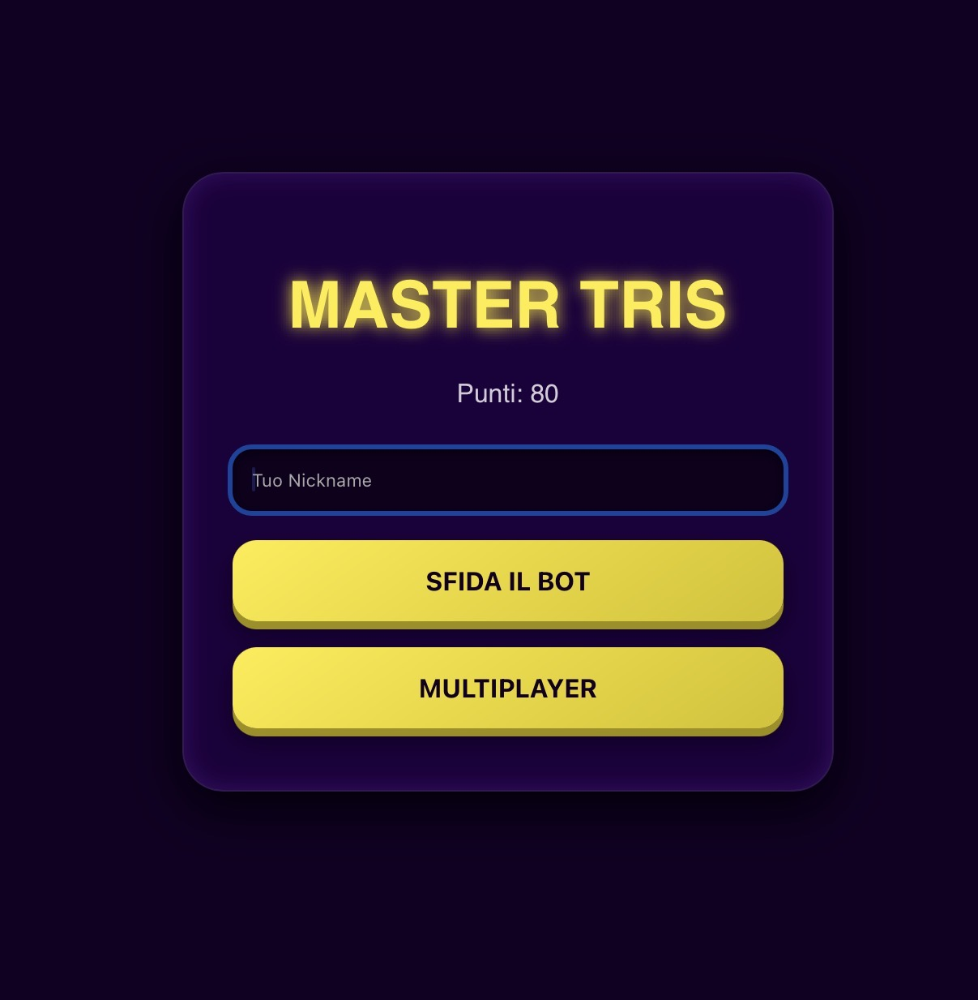

# MasterTris

MasterTris è un gioco ispirato al classico Tris con una veste neon e modalità multiple: sfida contro bot, partita locale sullo stesso dispositivo o multiplayer online tramite connessione peer-to-peer.

Il gioco include:
- Modalità contro bot (facile, media, difficile con Minimax)
- Multiplayer locale sullo stesso dispositivo
- Multiplayer online via PeerJS (codice stanza)
- Sistema punteggio salvato in localStorage
- UI neon 3D con animazioni e feedback visivi
- Nome giocatore personalizzabile
- Gestione turni e stato partita in tempo reale

È collegato alla repository centrale MasterGames (https://mastersabba.github.io/MasterSabba/), che contiene tutti i minigiochi della serie Master.

